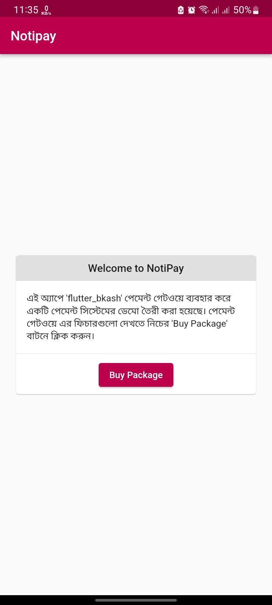
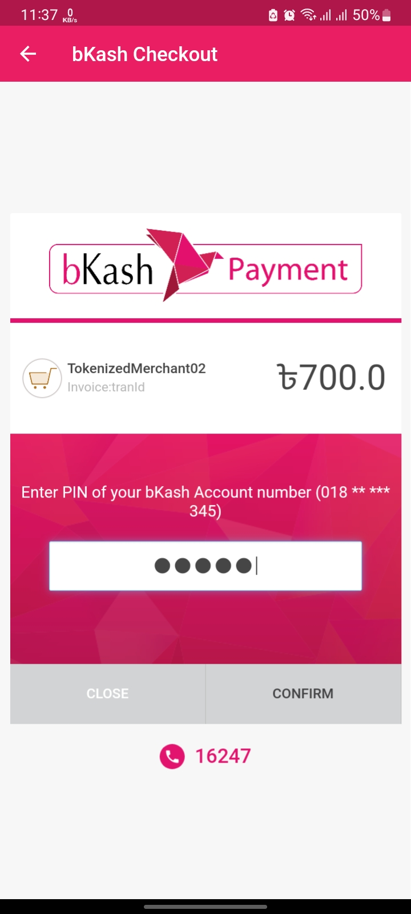
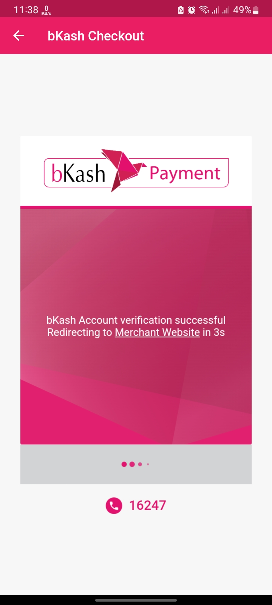

# bKash Payment Gateway Integration in Flutter

In this project I was simply created a payment gateway of bKash in Flutter application. I used `flutter_bkash` package and it is only for testing purpose.

---

### Screenshots

  
  
  
  
  
  

---

For more information, read the documentation of the flutter [package](https://pub.dev/packages/flutter_bkash)
